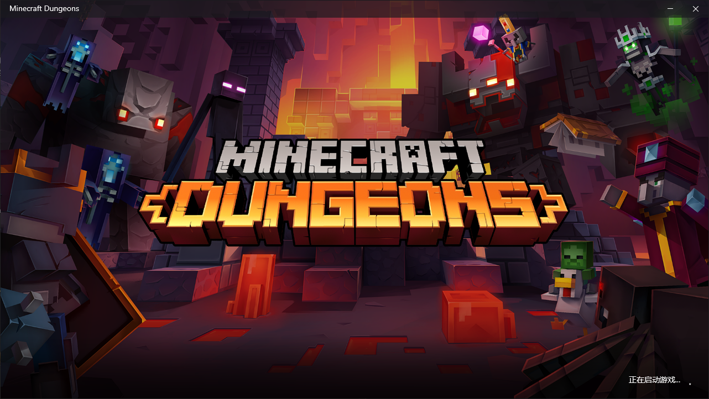
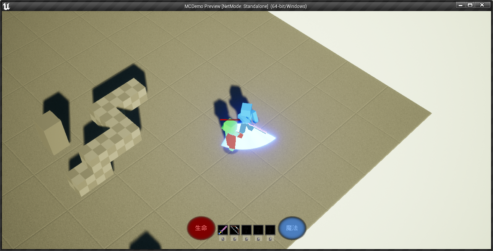
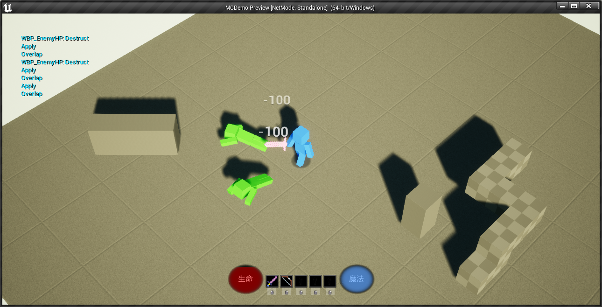
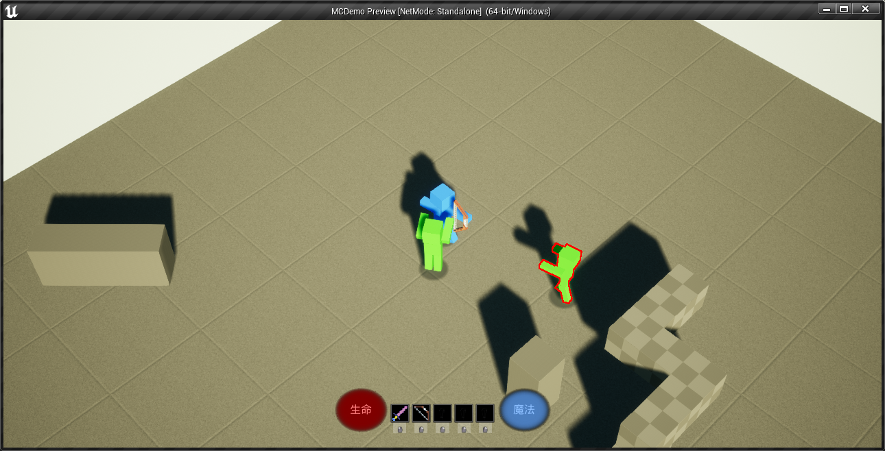
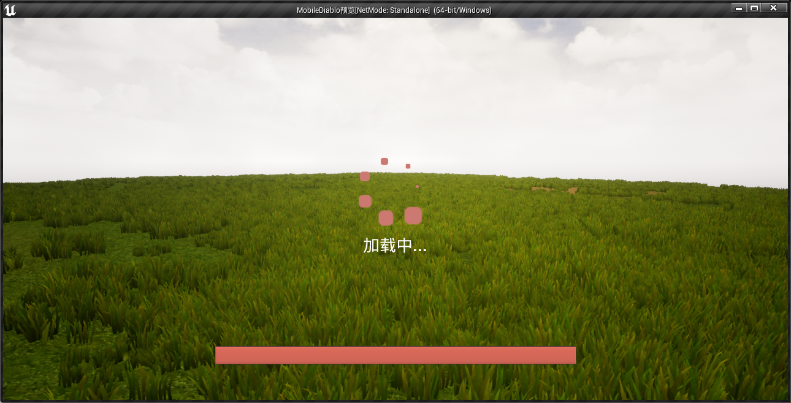
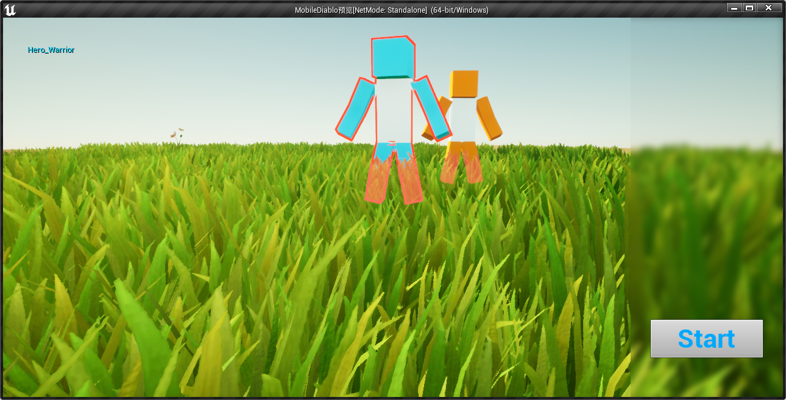
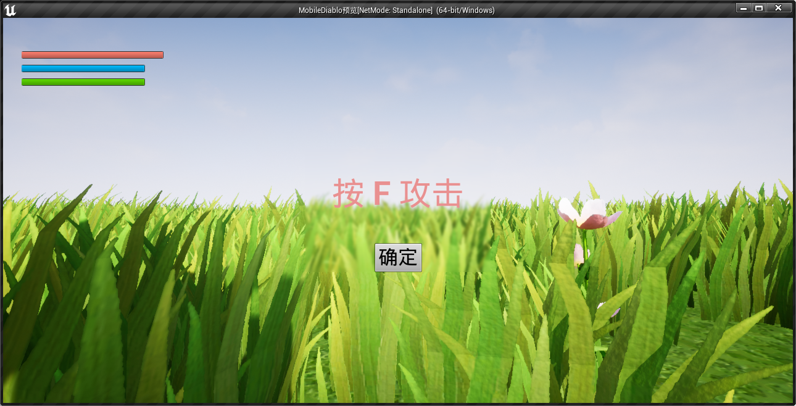
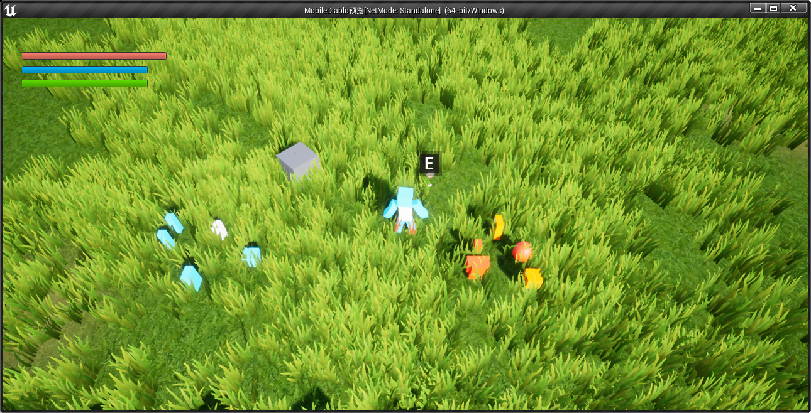
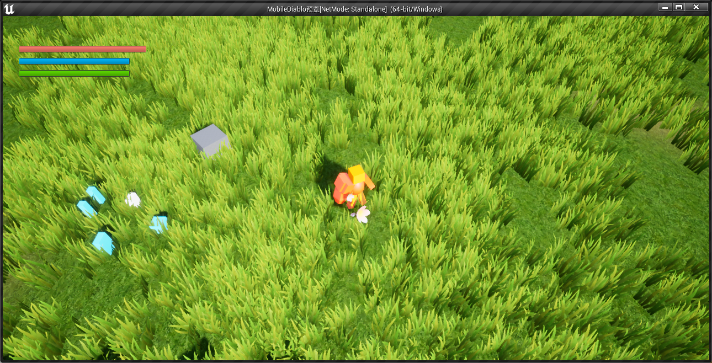
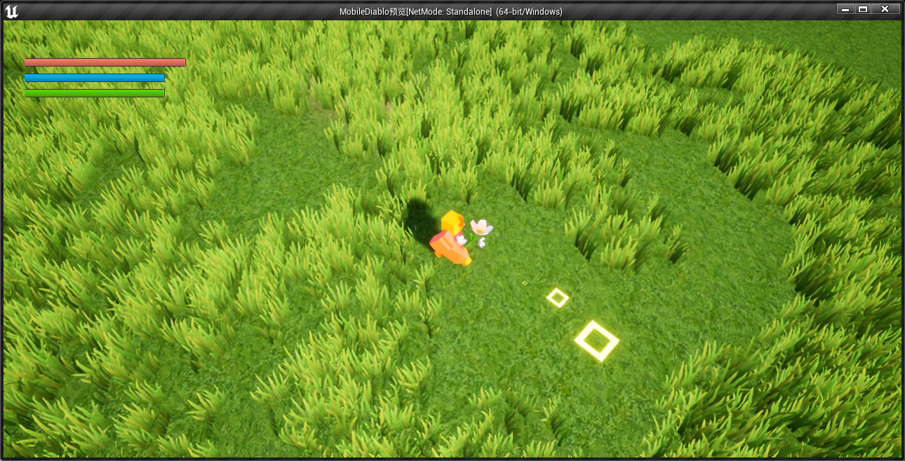

# MobileDiablo

仅供学习的c++ demo，不要在各平台发布，后续将持续更新

## 特点
1. 类似mc地牢特殊的走路系统
2. 装备展现系统
3. 技能系统
4. 基础属性系统
5. 简单战斗系统
6.  TODO 等我工作后慢慢加...

## 展示

- 想仿写 "我的世界:地牢" :  
  
  

- 蓝图和GAS（Gameplay Abilities插件）写的纯战斗版本：  
  
  
  

- 目前版本进度：  
  
  
  
  
  
  
